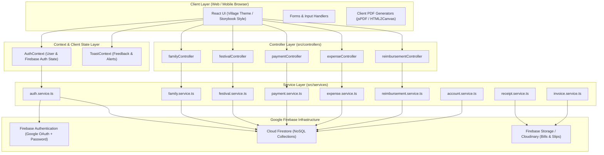
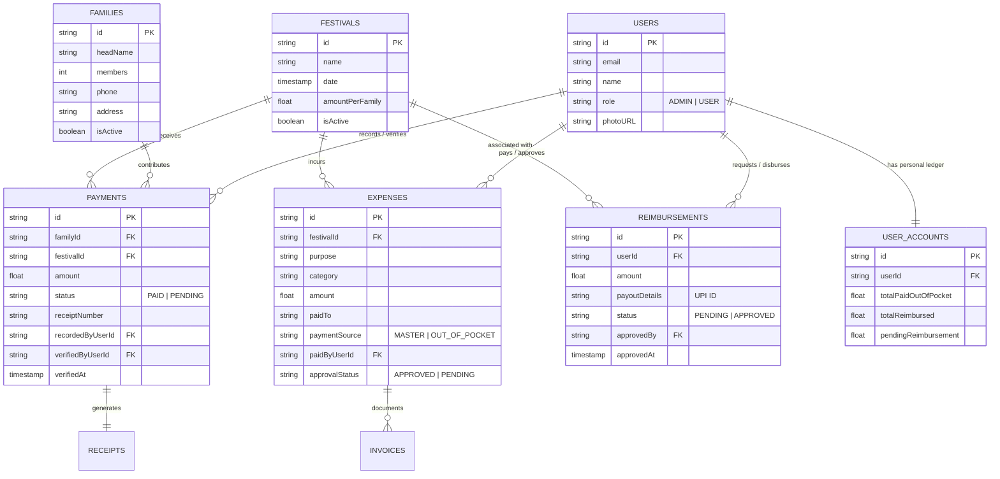
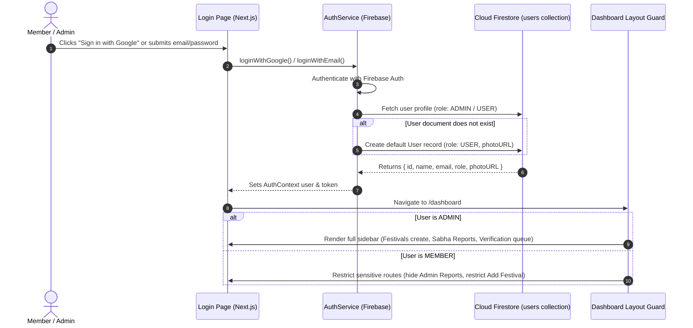
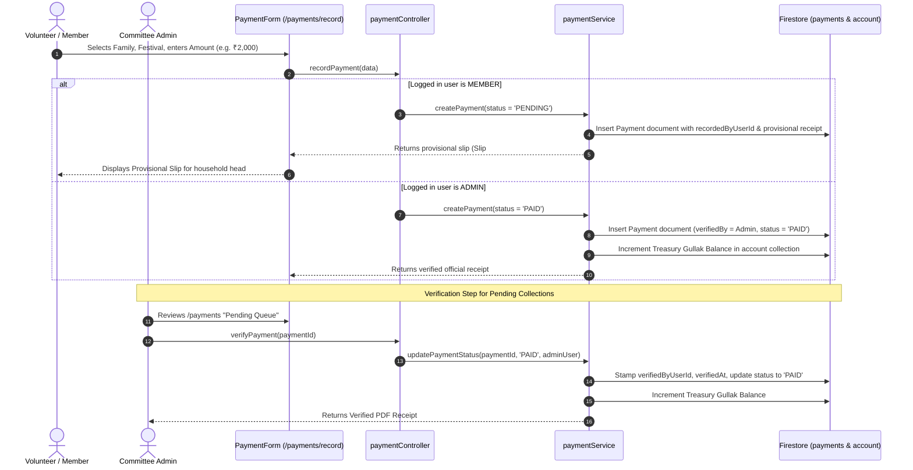
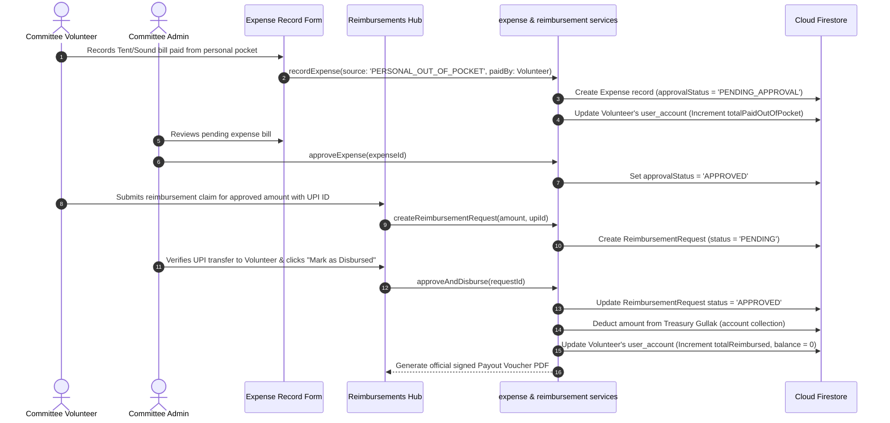
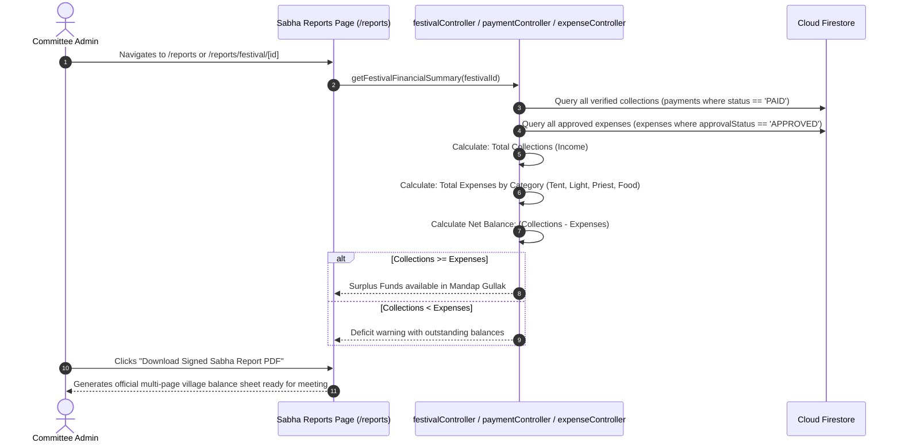

# 🌾 LBC Mandap — Comprehensive Developer Documentation & Architecture Guide

> **System Name:** Luhuren Bada Chanda (LBC) Digital Mandap & Financial Management System  
> **Lead Developer:** Rajat Kumar Sahu (Software Engineer @ Tech Mahindra)  
> **Linktree:** [https://linktr.ee/Rajatroshan](https://linktr.ee/Rajatroshan)  
> **Version:** 1.0.0 (Production Ready)  
> **Core Motto:** *"Mili-juli chanda se khilta gaon, 100% Khula Hisab"* (Transparent Community Accounts)

---

## 📑 Table of Contents

1. [System Overview & Business Domain](#1-system-overview--business-domain)
2. [Technology Stack & Core Libraries](#2-technology-stack--core-libraries)
3. [System Architecture Diagram](#3-system-architecture-diagram)
4. [Directory & File Hierarchy](#4-directory--file-hierarchy)
5. [Database Schema & Firestore Data Model](#5-database-schema--firestore-data-model)
6. [Database Entity Relationship Diagram (ERD)](#6-database-entity-relationship-diagram-erd)
7. [Core Workflows & Working Diagrams](#7-core-workflows--working-diagrams)
   - [7.1 Authentication & Role-Based Access Control (RBAC)](#71-authentication--role-based-access-control-rbac)
   - [7.2 Chanda Collection & Digital Receipt Workflow](#72-chanda-collection--digital-receipt-workflow)
   - [7.3 Vendor Expense & Out-of-Pocket Reimbursement Workflow](#73-vendor-expense--out-of-pocket-reimbursement-workflow)
   - [7.4 Gram Sabha Financial Audit & Balance Sheet Workflow](#74-gram-sabha-financial-audit--balance-sheet-workflow)
8. [Audit Trail & Safety Logging Architecture](#8-audit-trail--safety-logging-architecture)
9. [Component & State Hierarchy](#9-component--state-hierarchy)
10. [Local Development Setup & Deployment Guide](#10-local-development-setup--deployment-guide)

---

## 1. System Overview & Business Domain

LBC Mandap is an enterprise-grade village community fund management platform engineered for Indian rural panchayats, puja mandap committees, and festival organizations. It automates:

* **Gram Parivar Directory:** Unified registry of village households, family heads, contact details, and lifetime contribution histories.
* **Utsav & Puja Governance:** Scheduling festivals (Durga Puja, Ganesh Chaturthi, Diwali, etc.), calculating household chanda targets, and tracking active quotas.
* **Doorstep Chanda Collection:** Digital recording of cash and UPI collections with automatic provisional receipts and Admin verification workflows.
* **Kharcha Bahi-Khata (Expense Register):** Logging vendor payments (tents, sound, lighting, catering, priests) with bill uploads and approval queues.
* **Kisan & Volunteer Reimbursements Hub:** Tracking out-of-pocket expenses borne by committee members with individual ledger tracking, UPI payouts, and signed vouchers.
* **100% Khula Hisab (Audit Reports):** Automated Sabha balance sheets, income vs. expense reconciliation, and instant PDF audit exports.

---

## 2. Technology Stack & Core Libraries

| Layer | Technology | Purpose |
| :--- | :--- | :--- |
| **Framework** | **Next.js 14 (App Router)** | Server & Client Components, file-based routing, image optimization |
| **Language** | **TypeScript 5.x** | Strict typing, domain model interfaces, type safety |
| **UI & Design** | **Tailwind CSS 3.x** | Responsive design, custom Indian Village theme palette |
| **Icons** | **Lucide React** | Scalable, clean SVG icons throughout application |
| **Backend & Auth** | **Firebase 10.x (Client SDK)** | Google OAuth, Email/Password auth, session management |
| **Database** | **Cloud Firestore (NoSQL)** | Document store for collections, subcollections, transactions |
| **Architecture** | **Layered Clean Architecture (MVC)** | Models $\rightarrow$ Services $\rightarrow$ Controllers $\rightarrow$ Contexts $\rightarrow$ UI Components |

---

## 3. System Architecture Diagram



---

## 4. Directory & File Hierarchy

```
c:\lbc\LBC\
├── .env.local                          # Environment variables (Firebase API keys)
├── next.config.mjs                     # Next.js bundler configuration
├── package.json                        # Dependencies, scripts, and engine specs
├── tsconfig.json                       # TypeScript compiler options
├── DEVELOPER_DOCS.md                   # This master documentation file
│
└── src/
    ├── app/                            # Next.js 14 App Router Directory
    │   ├── layout.tsx                  # Root HTML wrapper with Providers
    │   ├── page.tsx                    # Public Landing Page (Village Theme)
    │   ├── globals.css                 # Custom animations, font styling, scrollbar rules
    │   │
    │   ├── auth/                       # Public Authentication Module
    │   │   ├── login/page.tsx          # Login page (Email & Google OAuth)
    │   │   └── register/page.tsx       # Member registration page
    │   │
    │   ├── (dashboard)/                # Protected Dashboard Layout & Routes
    │   │   ├── layout.tsx              # Sidebar + Header wrapper with route guard
    │   │   ├── components/             # Dashboard Layout Shared UI
    │   │   │   ├── Header.tsx          # Header with user avatar, greeting, Admin badge
    │   │   │   └── Sidebar.tsx         # Responsive sidebar with orange-to-green gradient
    │   │   │
    │   │   ├── dashboard/page.tsx      # Main Treasury Dashboard (Matka Gullak)
    │   │   ├── families/               # Gram Parivar Directory Pages
    │   │   │   ├── page.tsx            # Household listing with search & filters
    │   │   │   └── create/page.tsx     # Add new family form
    │   │   │   └── [id]/               # Dynamic Family Profile & Lifetime Ledger
    │   │   │       ├── page.tsx        # Details view
    │   │   │       └── edit/page.tsx   # Edit family details
    │   │   ├── festivals/              # Utsav & Puja Management Pages
    │   │   │   ├── page.tsx            # Active/past festival cards
    │   │   │   ├── create/page.tsx     # Schedule new festival (Admin only)
    │   │   │   └── [id]/               # Festival details & contribution quota
    │   │   │       ├── page.tsx        # Breakdown view
    │   │   │       └── edit/page.tsx   # Edit festival dates & quotas
    │   │   ├── payments/               # Chanda Sangrah (Collections)
    │   │   │   ├── page.tsx            # Chanda register & verification queue
    │   │   │   └── record/page.tsx     # Digital chanda collection form
    │   │   ├── expenses/               # Kharcha Bahi-Khata (Expenses)
    │   │   │   ├── page.tsx            # Vendor bill ledger & categories
    │   │   │   └── record/page.tsx     # Record vendor payment form
    │   │   ├── reimbursements/page.tsx # Volunteer Out-of-Pocket Claims Hub
    │   │   ├── calendar/page.tsx       # Utsav & Tithi Calendar (Month/Year view)
    │   │   ├── reports/                # Sabha Financial Balance Sheets (Admin only)
    │   │   │   ├── page.tsx            # Master annual balance sheet
    │   │   │   └── festival/[id]/page.tsx # Per-festival deep audit & PDF export
    │   │   └── settings/page.tsx       # Account & preferences settings
    │   │
    │   └── (landing)/components/       # Landing Page Interactive Village Components
    │       ├── Navigation.tsx          # Responsive landing navbar
    │       ├── HeroSection.tsx         # Village landscape with swaying crops & cow
    │       ├── FeaturesSection.tsx     # Core modules & feature cards
    │       ├── HowItWorksSection.tsx   # Step-by-step village workflow
    │       ├── GlimpsesSection.tsx     # Live system preview cards
    │       ├── AboutSection.tsx        # Village history & community ethos
    │       ├── CommunityGlimpsesSection.tsx # Cultural photo carousel
    │       ├── DeveloperSection.tsx    # Lead developer profile (Rajat Kumar Sahu)
    │       ├── Footer.tsx              # Auspicious village footer with toran
    │       └── VillageIllustrations.tsx# Reusable SVGs (Diya, Matka, Crops, Toran)
    │
    ├── components/                     # Reusable Core React UI Components
    │   ├── auth/                       # LoginForm, RegisterForm, OAuthButtons
    │   ├── dashboard/                  # DashboardView (Metrics, charts, activity)
    │   ├── expenses/                   # ExpenseForm, ExpenseList, InvoiceViewer
    │   ├── family/                     # FamilyForm, FamilyList
    │   ├── festival/                   # FestivalForm, FestivalList
    │   ├── payments/                   # PaymentForm, PaymentList, ReceiptPreview
    │   ├── reports/                    # FestivalPaymentReport
    │   └── ui/                         # Button, Card, Input, Loader, Modal, Toast
    │
    ├── controllers/                    # Business Controller Layer
    │   ├── family.controller.ts        # Family business logic & validation
    │   ├── festival.controller.ts      # Festival calculation logic
    │   ├── payment.controller.ts       # Payment validation & status updates
    │   ├── expense.controller.ts       # Expense approval & ledger sync
    │   └── reimbursement.controller.ts # Out-of-pocket claim processing
    │
    ├── services/                       # Data Access & Firebase Service Layer
    │   ├── auth.service.ts             # Firebase Authentication & session logic
    │   ├── family.service.ts           # Firestore CRUD for `families` collection
    │   ├── festival.service.ts         # Firestore CRUD for `festivals` collection
    │   ├── payment.service.ts          # Firestore transactions for `payments`
    │   ├── expense.service.ts          # Firestore operations for `expenses`
    │   ├── reimbursement.service.ts    # Firestore claims & user ledgers
    │   ├── userAccount.service.ts      # Volunteer out-of-pocket balances
    │   ├── account.service.ts          # Central treasury gullak balance tracking
    │   ├── receipt.service.ts          # Digital receipt generation logic
    │   └── invoice.service.ts          # Vendor invoice processing
    │
    ├── models/                         # TypeScript Domain Interfaces
    │   └── index.ts                    # User, Family, Festival, Payment, Expense, etc.
    │
    ├── contexts/                       # React Context Providers
    │   ├── AuthContext.tsx             # Auth state, login/logout, user profile
    │   └── ToastContext.tsx            # Animated notification toasts
    │
    └── core/                           # System Constants & Configuration
        ├── routes/index.ts             # Centralized route definitions (APP_ROUTES)
        ├── config/                     # Environment configuration
        └── providers/                  # Root Firebase & Context composition
```

---

## 5. Database Schema & Firestore Data Model

All documents derive from `BaseEntity` with timestamp and actor tracking:

```typescript
export interface BaseEntity {
  id: string;
  createdAt: Date;
  updatedAt: Date;
  createdByUserId?: string;
  createdByUserName?: string;
  createdByUserEmail?: string;
  updatedByUserId?: string;
  updatedByUserName?: string;
  updatedByUserEmail?: string;
}
```

### 1. `users` Collection
Stores registered committee members and village administrators.
* `email`: String (Unique email)
* `name`: String (Full name)
* `role`: `'ADMIN' | 'USER'`
* `phone`: String (Optional)
* `photoURL`: String (Google Profile avatar URL)
* `createdAt`, `updatedAt`: Firestore Timestamps

### 2. `families` Collection
Stores household directory records.
* `headName`: String (e.g. `"Ghanashyam Sahu"`)
* `members`: Number (Count of family members)
* `phone`: String (Primary contact number)
* `address`: String (Village ward / street / house #)
* `isActive`: Boolean (`true` by default)
* *Audit fields:* `createdByUserId`, `createdByUserName`, `createdByUserEmail`

### 3. `festivals` Collection
Stores scheduled festivals and puja mandap events.
* `name`: String (e.g. `"Durga Puja 2026"`)
* `type`: String (e.g. `"Religious"`, `"Cultural"`)
* `date`: Firestore Timestamp (Start date)
* `endDate`: Firestore Timestamp (End date for multi-day events)
* `isMultiDay`: Boolean
* `amountPerFamily`: Number (Assessed contribution quota in ₹)
* `description`: String (Details, rituals, pandal notes)
* `isActive`: Boolean (`true` while ongoing)
* *Audit fields:* `createdByUserId`, `createdByUserName`, `createdByUserEmail`

### 4. `payments` Collection
Stores household chanda contributions and collection slips.
* `familyId`: String (Foreign key $\rightarrow$ `families.id`)
* `festivalId`: String (Foreign key $\rightarrow$ `festivals.id`)
* `amount`: Number (Amount paid in ₹)
* `paidDate`: Firestore Timestamp
* `status`: `'PAID' | 'UNPAID' | 'PENDING'`
* `receiptNumber`: String (Format: `LBC-YYYYMMDD-XXXXXX`)
* `notes`: String (Optional payment mode or notes)
* **Recording Audit Trail:**
  * `recordedByUserId`, `recordedByUserName`, `recordedByUserEmail`, `recordedByUserRole`
  * `recordedAt`: Firestore Timestamp
* **Verification Audit Trail:**
  * `verifiedByUserId`, `verifiedByUserName`, `verifiedByUserEmail`, `verifiedByUserRole`
  * `verifiedAt`: Firestore Timestamp

### 5. `expenses` Collection
Stores vendor bills and event costs.
* `purpose`: String (e.g. `"Puja Mandap Bamboo & Tarpaulin Tent"`)
* `category`: `'TENT' | 'FOOD' | 'DECORATION' | 'ENTERTAINMENT' | 'UTILITIES' | 'TRANSPORT' | 'SOUND_LIGHT' | 'PRIEST' | 'OTHER'`
* `amount`: Number (Expense amount in ₹)
* `expenseDate`: Firestore Timestamp
* `paidTo`: String (Vendor / Contractor name)
* `contactNumber`: String (Vendor phone number)
* `festivalId`: String (Optional link to specific festival)
* `paymentSource`: `'MASTER_ACCOUNT' | 'PERSONAL_OUT_OF_POCKET'`
* `receiptUrl`: String (URL to uploaded physical bill image/PDF)
* **Out-of-Pocket & Approval Fields:**
  * `paidByUserId`, `paidByUserName`, `paidByUserEmail`
  * `approvalStatus`: `'APPROVED' | 'PENDING_APPROVAL' | 'REJECTED'`
  * `approvedByUserId`, `approvedByUserName`, `approvedByUserEmail`, `approvedAt`
  * `reimbursementStatus`: `'NONE' | 'PENDING' | 'REIMBURSED'`
  * `reimbursedByUserId`, `reimbursedByUserName`, `reimbursedAt`
* **Recording Audit Trail:**
  * `recordedByUserId`, `recordedByUserName`, `recordedByUserEmail`, `recordedByUserRole`
  * `recordedAt`: Firestore Timestamp

### 6. `reimbursements` Collection
Stores formal settlement requests from volunteers who paid out-of-pocket.
* `userId`, `userName`, `userEmail`: String (Claimant member details)
* `amount`: Number (Claimed amount in ₹)
* `festivalId`, `festivalName`: String (Associated festival)
* `notes`: String (Summary of claimed expenses)
* `payoutDetails`: String (UPI ID, PhonePe/GPay number, or bank details)
* `status`: `'PENDING' | 'APPROVED' | 'REJECTED'`
* `approvedBy`, `approvedByName`, `approvedByEmail`, `approvedAt`: Admin approval data
* `receiptNumber`: String (Settlement voucher ID)

### 7. `user_accounts` Collection
Maintains real-time personal expense ledgers for committee members.
* `userId`, `userName`, `userEmail`
* `totalPaidOutOfPocket`: Number (Lifetime personal funds spent for the village)
* `totalReimbursed`: Number (Lifetime funds reimbursed back by the committee)
* `pendingReimbursement`: Number (`totalPaidOutOfPocket - totalReimbursed`)

### 8. `account` Collection (Singleton)
Central treasury gullak balance.
* `balance`: Number (Current cash/bank balance)
* `totalIncome`: Number (Cumulative collections)
* `totalExpense`: Number (Cumulative verified payouts)
* `lastTransactionDate`: Firestore Timestamp

---

## 6. Database Entity Relationship Diagram (ERD)



---

## 7. Core Workflows & Working Diagrams

### 7.1 Authentication & Role-Based Access Control (RBAC)



---

### 7.2 Chanda Collection & Digital Receipt Workflow



---

### 7.3 Vendor Expense & Out-of-Pocket Reimbursement Workflow



---

### 7.4 Gram Sabha Financial Audit & Balance Sheet Workflow



---

## 8. Audit Trail & Safety Logging Architecture

To ensure accountability and prevent financial manipulation, **every mutation records actor identity and role**:

1. **Actor Stamp Fields:**
   * `recordedByUserId`, `recordedByUserName`, `recordedByUserEmail`, `recordedByUserRole`
   * `recordedAt`: Timestamp of submission
2. **Verification Stamp Fields:**
   * `verifiedByUserId`, `verifiedByUserName`, `verifiedByUserEmail`, `verifiedByUserRole`
   * `verifiedAt`: Timestamp of admin verification
3. **Approval Stamp Fields:**
   * `approvedByUserId`, `approvedByUserName`, `approvedByUserEmail`, `approvedAt`
4. **Update Stamp Fields:**
   * `updatedByUserId`, `updatedByUserName`, `updatedByUserEmail`, `updatedAt`

*Example Payment Audit Snapshot in Firestore:*
```json
{
  "id": "pay_982341203",
  "familyId": "fam_rohit_agrawal",
  "festivalId": "fest_durga_puja_2026",
  "amount": 2000,
  "status": "PAID",
  "receiptNumber": "LBC1788312172652859",
  "paidDate": "2026-09-02T00:00:00.000Z",
  "recordedByUserId": "usr_rajat_techm",
  "recordedByUserName": "Rajat Kumar Sahu",
  "recordedByUserEmail": "rajatroshan2002@gmail.com",
  "recordedByUserRole": "ADMIN",
  "recordedAt": "2026-09-02T01:45:00.000Z",
  "verifiedByUserId": "usr_rajat_techm",
  "verifiedByUserName": "Rajat Kumar Sahu",
  "verifiedByUserEmail": "rajatroshan2002@gmail.com",
  "verifiedByUserRole": "ADMIN",
  "verifiedAt": "2026-09-02T01:46:12.000Z"
}
```

---

## 9. Component & State Hierarchy

```
RootLayout (src/app/layout.tsx)
  └── FirebaseProvider
      └── ToastProvider
          └── AuthProvider (useAuth hook)
              │
              ├── [Public Landing Page] (src/app/page.tsx)
              │     ├── Navigation (Sticky, mobile drawer)
              │     ├── HeroSection (Village animation, Matka counter)
              │     ├── FeaturesSection (Core capability cards)
              │     ├── HowItWorksSection (Step-by-step village guide)
              │     ├── GlimpsesSection (Screenshot showcases)
              │     ├── AboutSection (Ethos & transparency)
              │     ├── CommunityGlimpsesSection (Cultural photo carousel)
              │     ├── DeveloperSection (Rajat Kumar Sahu profile & Linktree)
              │     └── Footer (Traditional Toran & links)
              │
              └── [Protected Dashboard Layout] (src/app/(dashboard)/layout.tsx)
                    ├── Sidebar (Responsive, orange-to-green gradient, hidden scrollbar)
                    ├── Header (User greeting, Google avatar, Admin badge, logout)
                    └── Main Content Area (Clean ivory background, route children)
                          ├── /dashboard          -> DashboardView (Matka Gullak balance)
                          ├── /families           -> FamilyList & FamilyForm
                          ├── /festivals          -> FestivalList & FestivalForm
                          ├── /payments           -> PaymentList & PaymentForm
                          ├── /expenses           -> ExpenseList & ExpenseForm
                          ├── /reimbursements     -> Reimbursements Hub
                          ├── /calendar           -> Puja Calendar (Month/Year)
                          ├── /reports            -> Sabha Financial Reports (Admin)
                          └── /settings           -> User Preferences & Profile
```

---

## 10. Local Development Setup & Deployment Guide

### Prerequisites
* **Node.js:** v18.17.0 or later (Node 20+ recommended)
* **npm:** v9.x or later
* **Google Firebase Account:** Configured project with Firestore & Auth enabled

### 1. Clone & Install Dependencies
```bash
git clone https://github.com/Rajatroshan/LBC.git
cd LBC
npm install
```

### 2. Environment Configuration
Create a `.env.local` file in the project root:
```env
NEXT_PUBLIC_FIREBASE_API_KEY="your_api_key"
NEXT_PUBLIC_FIREBASE_AUTH_DOMAIN="your_project.firebaseapp.com"
NEXT_PUBLIC_FIREBASE_PROJECT_ID="your_project_id"
NEXT_PUBLIC_FIREBASE_STORAGE_BUCKET="your_project.appspot.com"
NEXT_PUBLIC_FIREBASE_MESSAGING_SENDER_ID="your_sender_id"
NEXT_PUBLIC_FIREBASE_APP_ID="your_app_id"
```

### 3. Run Local Development Server
```bash
npm run dev
```
Open [http://localhost:3000](http://localhost:3000) in your browser.

### 4. Build & Production Verification
```bash
npm run build
npm start
```
*Expected Build Output:* All 19 Next.js routes compile statically and dynamically with 0 TypeScript and 0 linting errors.

### 5. Recommended Firestore Security Rules
```javascript
rules_version = '2';
service cloud.firestore {
  match /databases/{database}/documents {
    // Helper functions
    function isAuthenticated() {
      return request.auth != null;
    }
    function isAdmin() {
      return isAuthenticated() && 
        get(/databases/$(database)/documents/users/$(request.auth.uid)).data.role == 'ADMIN';
    }

    // User profiles
    match /users/{userId} {
      allow read: if isAuthenticated();
      allow write: if isAuthenticated() && (request.auth.uid == userId || isAdmin());
    }

    // Families directory
    match /families/{familyId} {
      allow read: if isAuthenticated();
      allow write: if isAuthenticated();
    }

    // Festivals (Admins can create/edit, members can read)
    match /festivals/{festivalId} {
      allow read: if true;
      allow write: if isAdmin();
    }

    // Payments & collections
    match /payments/{paymentId} {
      allow read: if isAuthenticated();
      allow create: if isAuthenticated();
      allow update, delete: if isAdmin();
    }

    // Expenses & reimbursements
    match /expenses/{expenseId} {
      allow read: if isAuthenticated();
      allow create: if isAuthenticated();
      allow update, delete: if isAdmin();
    }

    match /reimbursements/{reimbursementId} {
      allow read: if isAuthenticated();
      allow create: if isAuthenticated();
      allow update, delete: if isAdmin();
    }
  }
}
```

---

## 👨💻 Developer Credits & Contact

* **Lead Developer & Architect:** Rajat Kumar Sahu
* **Designation:** Software Engineer @ Tech Mahindra
* **Portfolio & Links:** [https://linktr.ee/Rajatroshan](https://linktr.ee/Rajatroshan)
* **GitHub Repository:** [https://github.com/Rajatroshan/LBC](https://github.com/Rajatroshan/LBC)

